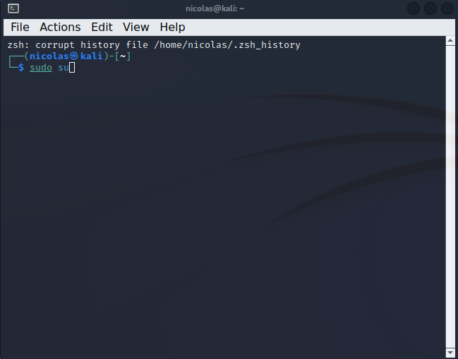
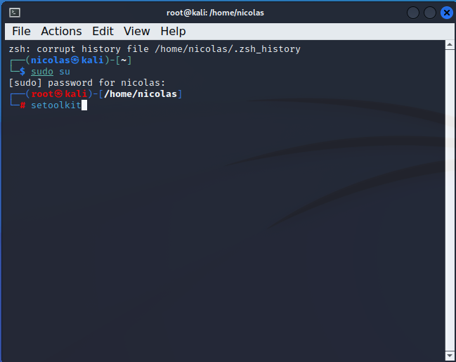
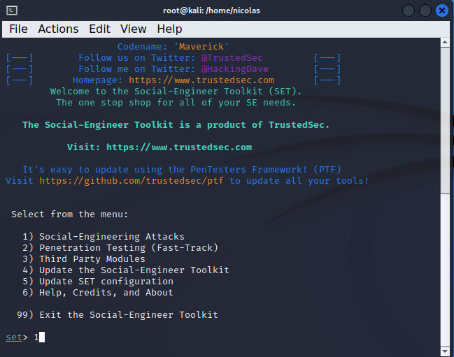
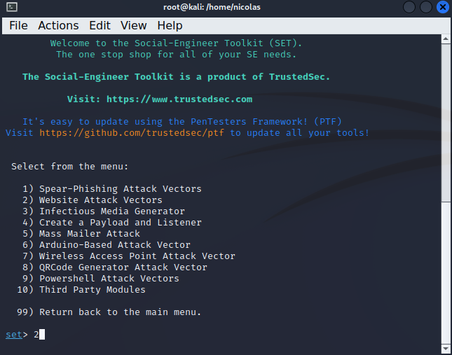
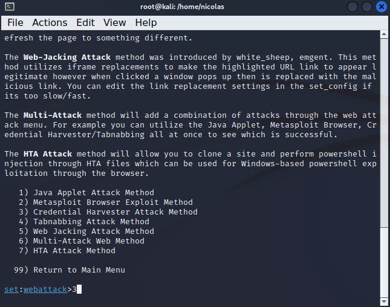

# Desafio-Phishing-Kali-Linux
Criação de um phishing atraves da ferramenta setoolkit no Kali Linux

Passo 1, escrever: "sudo su": 

Passo 2 escrever: "setoolkit":

Passo 3, digite 1 (Social-Engineering Attacks):

Passo 4, digite 2 (Web Site Attack Vectors):

Passo 5, digite 3 (Credential Harvester Attack Method ):

Passo 6, digite 2 (Site Cloner):

Passo 7, confirmar o IP da maquina, o IP sera usado para entrar no site

Passo 8, colocar o URL do site a ser clonado, neste caso:
http://www.facebook.com

Finalizando com as credenciais de exemplo:

